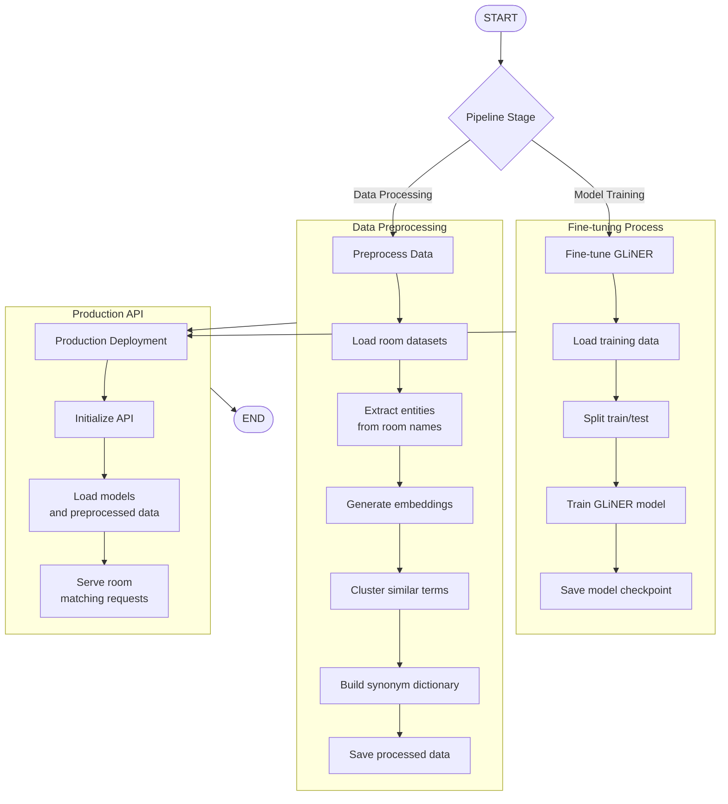
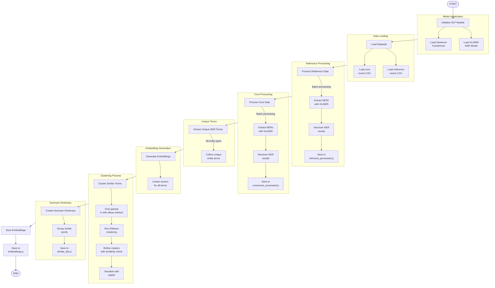
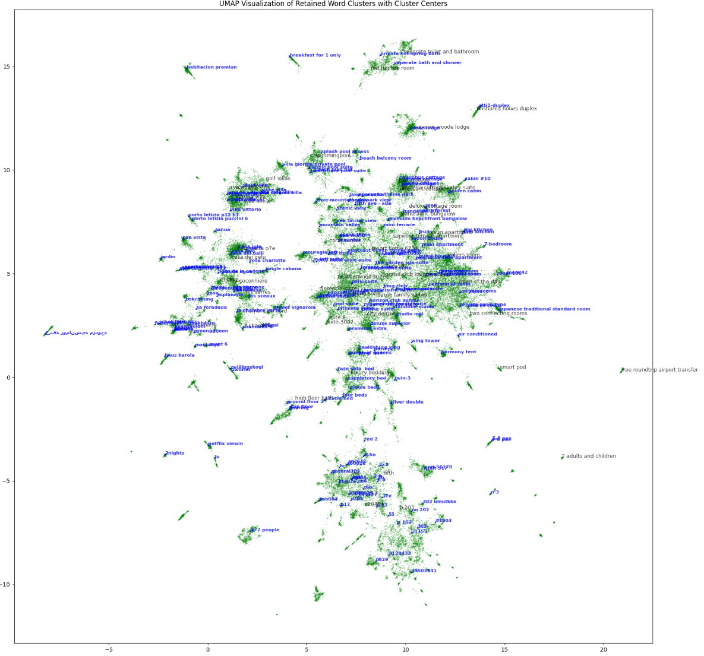
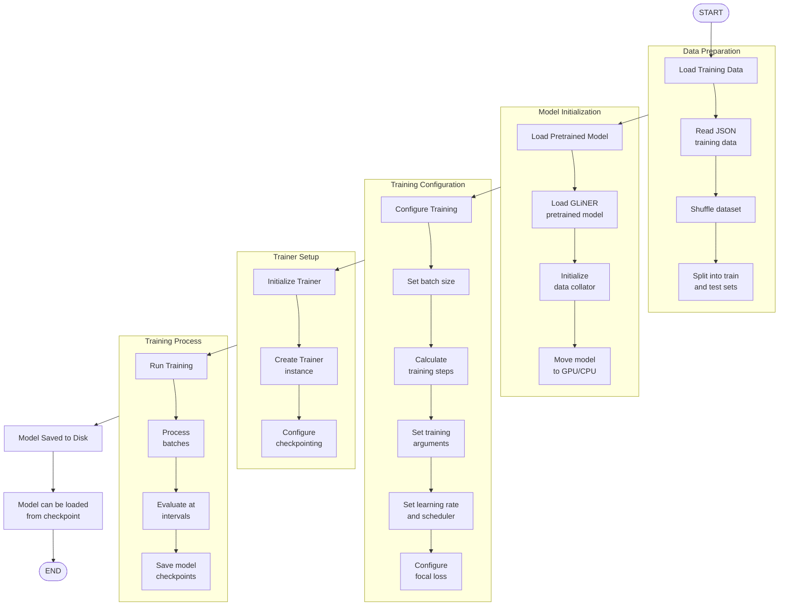
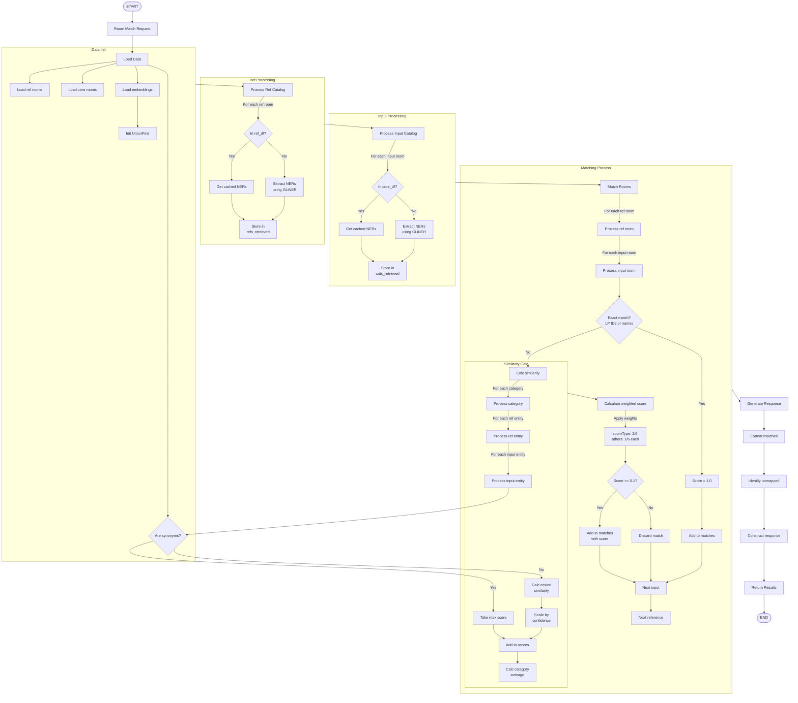
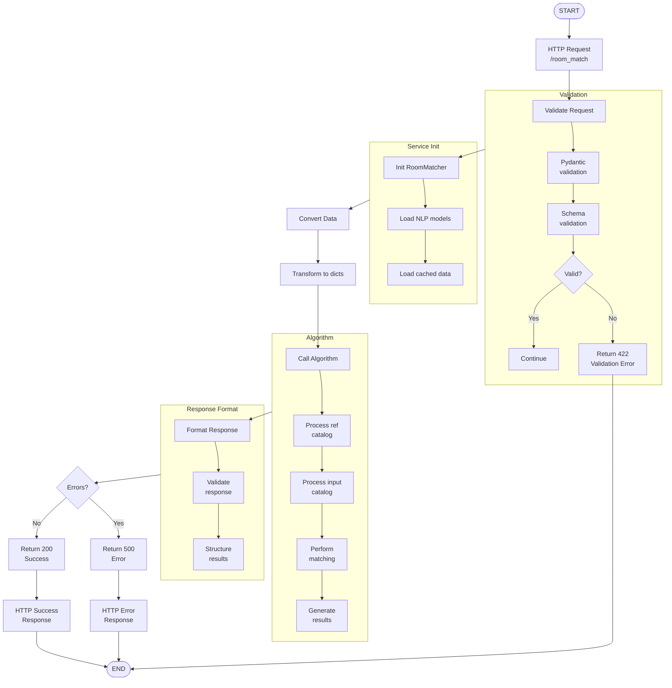

# Room Matching API (Nuitee Assignment)

This is an assignment report for Nuitee Room Matching API. Below is a short summary of the asisgnment

### Summary of the task
Build a machine learning API similar to the Cupid API’s Room Match feature. The API should handle POST requests and return sample request/response payloads in a similar format to the Cupid Room Match API. Provide a detailed explanation of your development process, including how you collect and process data, develop models, and scale the system.

## Table of Contents
- [Overview](#overview)
- [Approach](#approach)
- [System Architecture](#the-room-matchin-api)
- [Data Collection](#data-collection)
- [Data Processing](#data-processing)
- [Model Development](#model-development)
- [API Implementation](#api-implementation)
- [Testing and Evaluation](#testing-and-evaluation)
- [Installation and Usage](#installation-and-usage)
- [Future Improvements](#future-improvements)

## Overview

The Room Matching API is a machine learning-powered service designed to match hotel room descriptions across different data sources. It uses advanced natural language processing (NLP) techniques to identify and match rooms based on semantic similarity, providing a reliable way to consolidate room data from multiple suppliers.

This project delivers a REST API that accepts POST requests with room catalogs and returns matched rooms with confidence scores.

## Approach

### Problem Statement
Travel platforms aggregate hotel data from multiple suppliers, each with their own naming conventions for room types. This leads to:
- Duplicate room listings for the same physical room
- Inconsistent user experience when browsing room options
- Difficulty in comparing prices for equivalent rooms
- Challenges in maintaining a standardized room catalog

### Solution Methodology
The dataset provided includes room listings with their description in multiple languages such as:
```
Portuguese:
    porto letizia, 
    apartamento sant onofre, 
    apartamento brasilia, 

German:
    waldhäuschen,
    brandkop,
    rosskopfblick,
    diedamskopf

Arabic: 
    كوخ واسع
    بحوض استحمام بنظام دفع المياه
    منطقة الحديقة 
    شقة إستديو سوبيريور

```
And many more that include but not limited to `Korean, Russian, Turkish, English` and so on. Handling room listings with descriptions in multiple languages presents several Natural Language Processing (NLP) challenges. These include:

1. Since listings may not explicitly state their language, an initial step involves language detection to ensure appropriate downstream processing. Misclassification could lead to incorrect tokenization, parsing, or named entity recognition (NER) errors.

2. Different languages exhibit distinct morphological and syntactic structures. For example, English has relatively simple tokenization rules compared to languages like German (with compound words) or Chinese (which lacks spaces between words). This variability complicates uniform feature extraction.

3. Traditional NER models are typically trained for specific languages and struggle with multilingual text. Room listings often contain location names, amenities, and pricing information, which must be extracted regardless of language. A model trained on one language may fail to generalize well to others.

4. Some listings may include multiple languages within the same description, such as a French listing with English phrases or vice versa. Standard NLP pipelines struggle with mixed-language text, leading to degraded NER performance.

5. Many words and phrases may have different meanings in different languages. For example, "suite" in English refers to a type of room, while in French, it means "following." Standard models without contextual language understanding may misclassify such terms.

All these challenges make traditional NLP preprocessing steps such as cleaning, feature extraction, and normalization ineffective for this particular task, especially given the tight deadline. My research led me to discover and use LLM-based NER model for these preprocessing steps.

#### Why Use SOTA LLM-Based NER?

To address these challenges, I decided to use [GLiNER](https://aclanthology.org/2024.naacl-long.300/) , a state-of-the-art (SOTA) large language model (LLM)-based Named Entity Recognition (NER) system. GLiNER offers several advantages:

1. Multilingual Generalization: GLiNER leverages transformer-based models (e.g., multilingual BERT, XLM-R) trained on diverse languages, enabling high-performance entity recognition across different linguistic structures.

2. Context-Aware Entity Extraction: Unlike rule-based or traditional ML models, GLiNER understands context, reducing ambiguity in entity recognition across languages. For instance, it can differentiate between “suite” as a room type or as a continuation.

3. Handling Code-Switching: Since LLMs are trained on massive multilingual corpora, GLiNER can effectively process listings with mixed-language descriptions, ensuring accurate entity extraction without requiring separate models.

4. Zero-Shot and Few-Shot Adaptability: GLiNER can leverage in-context learning, meaning it can extract relevant entities even for low-resource languages or domains without requiring extensive retraining.

5. Scalability & Robustness: By using a transformer-based architecture, GLiNER can scale across multiple languages and listing formats, making it ideal for real-world applications where new languages or variations may emerge.

#### Semantic Matching with SentenceTransformer
Beyond entity recognition, I also leverage [SentenceTransformer](https://sbert.net/), another SOTA LLM-based model, for semantic similarity matching between multilingual room descriptions.

1. Cross-Lingual Sentence Embeddings: SentenceTransformer generates dense vector representations of text, capturing semantic meaning regardless of language. This allows to compare room descriptions across different languages with high accuracy.

2. Improved Listing Deduplication: Some listings describe the same property differently, particularly when translated manually. Using SentenceTransformer, I can identify near-duplicate listings even if their wording differs.

3. Efficient Search & Recommendation: By leveraging sentence embeddings, I improve search results and recommendation systems, ensuring that listings with similar features are matched accurately across languages.

4. Contextual Understanding for Better Grouping: Unlike simple TF-IDF or keyword-based methods, SentenceTransformer understands nuanced relationships between words, enabling more reliable semantic grouping of listings

#### Conclusion
Given the complexity of multilingual room listing descriptions, traditional NLP methods struggle with accurate NER extraction and semantic matching. To address this, I leverage GLiNER for entity recognition and SentenceTransformer for cross-lingual similarity detection within the Room Matching API.

To ensure fast and scalable retrieval, I implemented an efficient architecture that:

Stores embeddings and extracted entities (NER) in a database, reducing redundant model calls.
Caches processed data, minimizing the need for repeated inference and improving response times.
Only calls the models when data is missing, ensuring that the system remains efficient while maintaining high accuracy.
By combining LLM-based models with a smart retrieval architecture, I achieved a high-performance, scalable, and cost-efficient solution for processing and matching room listings across multiple languages.

## The Room Matchin API

The Room Matching API has three main components:

1. **Data Processing Pipeline**: Extracts features from room descriptions and builds a synonym dictionary for matching.

2. **Machine Learning Models**: Utilizes GLiNER (a Named Entity Recognition model) and SentenceTransformer for semantic similarity matching.

3. **API Service**: FastAPI-based REST service that handles room matching requests and returns structured responses.

**Note: while an example dataset and code for fine-tuning GLINER model is present, the fine-tuning dataset creation is a long process that would be impossible to complete in the tight deadline of the task.**

Below is the overall architecture:



## Data Collection

### Datasets
Two primary datasets were used for this project:

1. **Reference Rooms Dataset** (`referance_rooms.csv`): Contains hotel reference room data with the following fields:
   - hotel_id
   - lp_id (LP identifier)
   - room_id
   - room_name

2. **Core Rooms Dataset** (`updated_core_rooms.csv`): Contains supplier room data with the following fields:
   - core_room_id
   - core_hotel_id
   - lp_id
   - supplier_room_id
   - supplier_name
   - supplier_room_name

### Data Sources
In a production environment, these datasets would be collected from:
- Hotel Property Management Systems (PMS)
- Online Travel Agencies (OTAs) like Expedia, Booking.com
- Global Distribution Systems (GDS)
- Channel managers and bed banks
- Direct hotel partnerships

## Data Processing

The data processing pipeline consists of several key steps, implemented in `pretrain_on_dataset.py`. **This script can run on both GPU and CPU. However running the scirpt without a GPU will take days to complete. With an RTX 4090 24 GB, the total script runtime is approximately 2 hours.** I also provided a link for artifacts created by the script. See Installation and Usage for further details.



### Entity Extraction
I use GLiNER (Global-Local Information Enhanced Named Entity Recognition), a state-of-the-art NER model, to extract key entities from room descriptions:
- **roomType**: Suite, Apartment, Room
- **classType**: Deluxe, Standard, Executive
- **bedCount**: 2, Double, King
- **view**: Ocean, Garden, City
- **bedType**: King, Twin, Queen
- **features**: Balcony, Kitchen, Terrace

### Vector Embeddings
Each extracted entity is converted into a vector embedding using SentenceTransformer's `all-MiniLM-L6-v2` model, creating a semantic representation that captures meaning.

### Synonym Detection
To handle variations in terminology:
1. KMeans clustering groups semantically similar terms
2. Cosine similarity refines these clusters with a threshold of 0.7
3. A synonym dictionary is built from these clusters
4. UMAP visualization helps verify cluster quality

Below are few samples from few of the clusters out of 200 clusters in synonym dictionary:

```
Cluster 191:
double pod capsule, city pod, podo, pod 6, rainbow pod, glamping pod 2, pod pad, lower double pod, pod bunk, single capsule pod

Cluster 18:
villa apelviken, villa dewa sanzan, villa san michele, patara 5 villa, villa la vainilla, villa mari, villa ozel havuzlu, villa trisha, villa alkyon, selene villa

Cluster 164:
spa on deck, ocean spa b, spa garden, erehwon spa suite, accès spa, superior spa suite, ladies' spa, spa 301, designer spa room, accès gratuit spa

Cluster 47:
the roost cottage, mahavan cottage, seafront cottage, cassowary luxury cottage, sun kissed cottage, cottage 01, post cottage, avalon cottage, snug cottage, national park cottage

Cluster 160:
casa pepe, casa satya, casa the rose, casa gaia, casa oliva garden, casa ricardo, casa leo, casa milena garden, casa ananda, casa caraiva

Cluster 0:
hillside pool villa, prestige riverview pool villa, swim up villa, grand private pool villa, zukra pool villa, pool direct villa, sunset beach pool villa, golden sea pool villa, beachfront pool villa, nantha pool villa
```

Below is the 2D projection of clusters with blue indicating clusters centers and green dots each individual NER. Blacks are just examples from each cluster.




### Output Files
The preprocessing pipeline generates several key files:
- `refrooms_processed.p`: Processed reference room data with extracted entities
- `corerooms_processed.p`: Processed core room data with extracted entities
- `similar_dict.p`: Synonym dictionary for similar terms
- `embeddings.p`: Vector embeddings for all unique entities

In a production environment, the content of these files would be stored in various databases, including production databases (such as PostgreSQL, MySQL, or MongoDB), cache databases (like Redis or Memcached), and vector databases (such as Milvus, Qdrant, PostgreSQL with PG_Vector, or Faiss), depending on the specific use case.

## Model Development

The Room Matching API relies on two key ML models:

1. **GLiNER for Named Entity Recognition**
2. **SentenceTransformer for Semantic Embeddings**

These models come with pre-trained weights out of the box. However, for use in a production environment, they need to be fine-tuned on a custom dataset related to rooms and hotels. Below is the fine-tuning process for the GLiNER model, and a similar approach should be followed for fine-tuning the SentenceTransformer model. While these models perform well in zero-shot inference with high accuracy, enabling effective room and hotel NER extraction and semantic similarity measurement, fine-tuning with custom datasets will significantly improve accuracy and extraction quality, ultimately enhancing the performance of the overall Room Matching API.

### GLiNER 



The fine-tuning process in `finetune_gliner.py` includes:
1. Loading labeled training data in JSON format
2. Splitting into training (90%) and testing (10%) sets
3. Configuring training with:
   - Learning rate: 5e-6
   - Weight decay: 0.01
   - Batch size: 8
4. Training with evaluation steps and checkpointing
5. Saving the best model for production use

### Room Matching Algorithm

The core matching algorithm **combines several techniques**. This approach leverages **state-of-the-art large language models (LLMs)** for precise, **context-aware matching**, while maintaining **scalability** and **cost-effectiveness**. Techniques such as exact matching, semantic matching, and synonym handling ensure high-quality results without relying solely on computationally expensive processes. The use of vector embeddings and cosine similarity enhances accuracy, enabling efficient handling of large datasets. The architecture's **modularity and transparency** allow each step; data loading, entity extraction, semantic comparison, and thresholding—to be clearly defined and easily traced. **This makes the system highly explainable**. Additionally, modularity enables independent teams or team members to **improve specific modules without needing knowledge** of each other's tasks, **reducing communication errors and improve development**. As each module is enhanced, the system becomes more effective, adaptable, and optimized. Finally, adjusting the match threshold and fine-tuning models ensures a balance between precision and performance, scaling efficiently for production use without excessive resource consumption.

Below is the overall room matching algorithm flowchart:



1. **Initial Processing**:
   - Load data including reference rooms, core rooms, synonyms, and embeddings
   - Extract entities from room descriptions if not in database

2. **Matching Steps**:
   - **Exact Matching**: First check for exact matches by LP ID or room name (score = 1.0)
   - **Semantic Matching**: For non-exact matches, compare entities across categories
   - **Synonym Handling**: Using the UnionFind data structure to identify equivalent terms
   - **Cosine Similarity**: Calculate vector similarity between entities
   - **Weighted Scoring**: Apply weights to different entity categories (roomType has highest weight at 2/6)

3. **Thresholding and Output**:
   - Apply a match threshold (set to 0.1 by default for demonstration purposes). With fine-tuning, this threshold will be increased to ensure higher precision and avoid incorrect matches. By adjusting the threshold after fine-tuning, the Room Matching API can improve its ability to accurately match rooms and hotels, reducing the chances of erroneous pairings.
   - Return matched rooms with scores and unmapped rooms


## API Implementation

### FastAPI Implementation

The API is built using FastAPI, a modern Python web framework optimized for APIs and high performance.



Key API components:
1. **Request Validation**: Uses Pydantic models to validate input data
2. **Service Layer**: The RoomMatcher class implements the core matching logic
3. **Response Formatting**: Structured response with matched and unmapped rooms

### API Endpoints

1. **Health Check**: `GET /health`
   - Returns status of data loading and API health

2. **Room Matching**: `POST /room_match`
   - Input: JSON with reference and input room catalogs
   - Output: JSON with matched rooms and matching scores

### Request/Response Format

**Request Format:**
```json
{
  "referenceCatalog": [
    {
      "hotel_id": "13705497",
      "lp_id": "lp182dfe",
      "room_id": "1142671139",
      "room_name": "Suite"
    }
  ],
  "inputCatalog": [
    {
      "hotel_id": "1700209184",
      "lp_id": "lp65572220",
      "supplier_room_id": "314291539",
      "supplier_name": "Expedia",
      "supplier_room_name": "Apartment"
    }
  ]
}
```

**Response Format:**
```json
{
  "results": [
    {
      "room_name": "Suite",
      "room_id": "1142671139",
      "hotel_id": "13705497",
      "lp_id": "lp182dfe",
      "mapped_rooms": [
        {
          "core_hotel_id": "1700209184",
          "lp_id": "lp65572220",
          "supplier_room_id": "314291539",
          "supplier_name": "Expedia",
          "supplier_room_name": "Apartment",
          "reference_match_score": 0.85
        }
      ]
    }
  ],
  "unmapped_rooms": []
}
```

## Testing and Evaluation

### Test Coverage

The project has comprehensive test coverage (55% overall):
- 100% coverage of model schemas
- 94% coverage of main application
- 47% coverage of matching service
- Tests for various room matching scenarios

### Test Types

1. **Unit Tests**:
   - `test_unionfind.py`: Tests for the UnionFind data structure
   - `test_roommatcher.py`: Tests for the core matching functionality
   - `test_room_matching_scenarios.py`: Tests different matching cases

2. **Integration Tests**:
   - `test_api_routes.py`: Tests for API endpoints
   - `test_client.py`: Tests client interaction

### Evaluation Metrics

The provided dataset is unstructured and unlabelled, making it challenging to measure the overall performance of the API. In typical development environments, performance evaluation would be done by creating a labelled dataset to measure model performance, not just for the overall room matching algorithm but also for the individual components of the matching logic. However, due to time constraints, it was not possible to generate a labelled dataset for this task. Once a labelled dataset is available, the following metrics will be used to assess the performance of the overall room matching algorithm:

1. **Precision**: Percentage of correct matches from all predicted matches
2. **Recall**: Percentage of correct matches retrieved from all actual matches
3. **F1 Score**: Harmonic mean of precision and recall
4. **Match Confidence Distribution**: Distribution of match confidence scores

Despite the lack of a labelled dataset, the GLiNER model has shown strong accuracy in Named Entity Recognition (NER) extraction, ensuring reliable entity identification in the absence of ground-truth labels. please refer the [the paper](https://aclanthology.org/2024.naacl-long.300.pdf) for details about performance metrics. With domain specific fine-tuning, the accuracy scores would be even higher.

### Model Explainability

The system provides explainability through:
1. **Confidence Scores**: Each match includes a confidence score
2. **Entity-Level Matching**: Detailed entity matching for transparency with confidence about each entity.
3. **Synonym Mapping**: Clear indication of which terms are considered equivalent

## Installation and Usage

### Prerequisites
- Python 3.12+
- CUDA-compatible GPU (recommended for faster processing)

### Installation

1. Clone the repository:
```bash
git clone https://github.com/yourusername/room-matching-api.git
cd room-matching-api
```

2. Install dependencies:
```bash
pip install -r requirements.txt
```

3. Install development dependencies (for running tests):
```bash
pip install -r requirements-dev.txt
```

4. Download the archived artifacts, extract them and place them inside the /datasets folder in the project folder.
```
Download the archive from: 
https://drive.google.com/file/d/1AyQCRHrFmCbXuVgAsxZXG44sC0aTKBL-/view?usp=sharing

Extrac the files inside and store them in ./datasets folder as follows:

./datasets/corerooms_processed.p
./datasets/embeddings.p
./datasets/finetune_dataset.json
./datasets/referance_rooms.csv
./datasets/refrooms_processed.p
./datasets/similar_dict.p
./datasets/updated_core_rooms.csv

```

### Running the API

Start the API server:
```bash
uvicorn main:app --reload
```

The API will be available at http://localhost:8000.

Make a POST request via client example in another terminal:
```bash
python client_example.py
```

### Running the Tests

Run all tests with coverage reporting:
```bash
python run_tests.py
```

Run specific test categories:
```bash
python -m pytest tests/unit/
python -m pytest tests/integration/
```

### Data Preprocessing

To run the data preprocessing pipeline:

IMPORTANT: without a GPU, this will take few days to complete.

```bash
python pretrain_on_dataset.py
```

### Model Fine-tuning

To fine-tune the GLiNER model:

IMPORTANT: without a GPU, this will take few days to complete.

```bash
python finetune_gliner.py
```

## Future Improvements

1. **Model Performance**:
   - Fine-tune models specifically for hotel domain
   - Implement post processing and cleaning pipeline for extracted NERs.
   - Experiment with ML models for room matching algorithm after NER extraction instead of weight based matching.
   - Create labelled dataset for end-to-end matching algorithm performance measurement.
   - Implement MLOps tracking system such as MLFlow for ML model version tracking as well as serving.

2. **System Enhancements**:
   - Implement batch processing for large requests via vectorized matching algorithm. 

3. **Infrastructure**:
   - Containerize with Docker for easier deployment
   - Add production databases, cache databases and vector databases.
   - Implement model versioning and A/B testing
